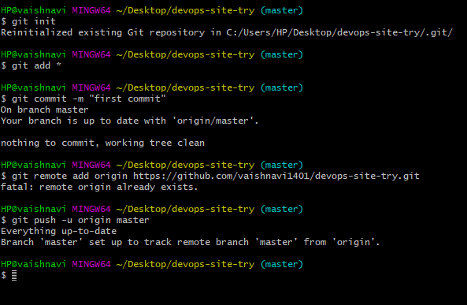

**How to setup a Jenkins production and testing pipeline using docker?**

Assumptions: Jenkins And Docker are installed in RHEL OS

Jenkins is added in sudoers file.

User has a Github Profile and Git Bash is Installed

1\. Create a folder on your preferred place

2.Create a index.html file and write something it .

3\. pushing the code into github

4\.Jenkins (CI server) will fetch the code from the github account automatically upon check-in. 

 
 
5\.Jenkins will run, launch a docker container and will deploy the code in  Apache2 web server

6\.4.	Test whether the container is launched or not ,if an error occurs sends a mail to the developer 

7\.	Build a pipeline for automating a webserver

8\. website is up by a single click
